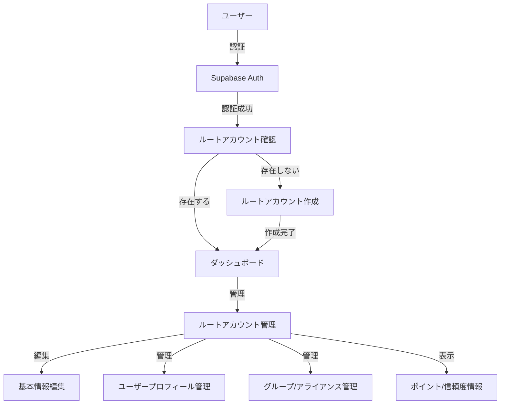

# Design Document

## Overview

このドキュメントでは、ルートアカウント作成および管理機能の設計について詳細に説明します。ルートアカウントはシステム内でユーザーの基本情報、ポイント、信頼度などを管理する中核的な要素であり、複数のユーザープロフィール、グループ、アライアンスを管理するための基盤となります。

## アーキテクチャ

ルートアカウント機能は、Next.js 15のApp Routerを使用したフロントエンドとSupabaseを使用したバックエンドで構成されます。認証はSupabaseの認証機能を利用し、データはSupabaseのPostgreSQLデータベースに保存されます。

### 全体アーキテクチャ図



## コンポーネントとインターフェース

### 1. ルートアカウント確認コンポーネント

ユーザーが認証後、ルートアカウントが存在するかを確認します。

```typescript
// src/components/root-account/RootAccountCheck.tsx
import { createClient } from '@/lib/supabase/server';
import { redirect } from 'next/navigation';

export async function RootAccountCheck() {
  const supabase = await createClient();

  // 認証ユーザー情報を取得
  const { data: { user } } = await supabase.auth.getUser();

  if (!user) {
    redirect('/login');
  }

  // ルートアカウントの存在確認
  const { data: rootAccount } = await supabase
    .from('root_accounts')
    .select('*')
    .eq('auth_id', user.id)
    .single();

  if (!rootAccount) {
    redirect('/root-account/create');
  }

  redirect('/dashboard');
}
```

### 2. ルートアカウント作成フォーム

ルートアカウントの基本情報を入力するフォームを実装します。

```typescript
// src/components/root-account/RootAccountCreationForm.tsx
import { useState } from 'react';
import { createClient } from '@/lib/supabase/client';
import { useRouter } from 'next/navigation';

export function RootAccountCreationForm() {
  const supabase = createClient();
  const router = useRouter();
  const [formData, setFormData] = useState({
    earthRegion: '',
    nativeLanguage: '',
    siteLanguage: 'ja',
    birthGeneration: '',
    agreeToOasisDeclaration: false,
  });

  const handleSubmit = async (e) => {
    e.preventDefault();

    const { data: { user } } = await supabase.auth.getUser();

    if (!user) {
      return;
    }

    // ルートアカウント作成
    const { error } = await supabase.from('root_accounts').insert({
      auth_id: user.id,
      earth_region: formData.earthRegion,
      native_language: formData.nativeLanguage,
      site_language: formData.siteLanguage,
      birth_generation: formData.birthGeneration,
      agree_to_oasis_declaration: formData.agreeToOasisDeclaration,
      trust_points: 30, // 初期信頼度ポイント
      max_points: calculateMaxPoints(user), // 認証方法に基づいて計算
      current_points: calculateMaxPoints(user), // 初期値は最大値と同じ
    });

    if (error) {
      console.error('Error creating root account:', error);
      return;
    }

    router.push('/root-account/values-questionnaire');
  };

  // 認証方法に基づいて最大ポイントを計算
  const calculateMaxPoints = (user) => {
    let basePoints = 100;
    const identities = user.identities || [];

    // 認証プロバイダーごとにポイントを加算
    const providers = new Set(identities.map(identity => identity.provider));
    basePoints += providers.size * 50;

    return basePoints;
  };

  return (
    <form onSubmit={handleSubmit} className="space-y-6">
      {/* フォームフィールド */}
      <div>
        <label htmlFor="earthRegion">地球3分割（主に活動している時間帯）</label>
        <div className="mb-2">
          <p className="text-sm text-gray-600 mb-2">
            地球を日付変更線を中心に120度毎に3つの地域に分割しています：
          </p>
          <div className="text-xs text-gray-500">
            <div>地域1: 日付変更線〜東経60度（アジア・オセアニア）</div>
            <div>地域2: 東経60度〜西経60度（ヨーロッパ・アフリカ）</div>
            <div>地域3: 西経60度〜日付変更線（南北アメリカ）</div>
          </div>
          <div className="mt-2">
            <svg width="300" height="150" viewBox="0 0 300 150" className="border">
              <rect width="300" height="150" fill="#e6f3ff"/>
              <circle cx="150" cy="75" r="60" fill="#4a90e2" stroke="#2c5aa0" strokeWidth="2"/>
              <line x1="150" y1="15" x2="150" y2="135" stroke="#ff0000" strokeWidth="2"/>
              <line x1="110" y1="25" x2="110" y2="125" stroke="#00aa00" strokeWidth="1"/>
              <line x1="190" y1="25" x2="190" y2="125" stroke="#00aa00" strokeWidth="1"/>
              <text x="80" y="10" fontSize="10" fill="#333">地域3</text>
              <text x="130" y="10" fontSize="10" fill="#333">地域1</text>
              <text x="200" y="10" fontSize="10" fill="#333">地域2</text>
              <text x="10" y="145" fontSize="8" fill="#666">日付変更線を中心に120度毎に分割</text>
            </svg>
          </div>
        </div>
        <select
          id="earthRegion"
          value={formData.earthRegion}
          onChange={(e) => setFormData({...formData, earthRegion: e.target.value})}
          required
        >
          <option value="">選択してください</option>
          <option value="1">地域1（アジア・オセアニア）</option>
          <option value="2">地域2（ヨーロッパ・アフリカ）</option>
          <option value="3">地域3（南北アメリカ）</option>
        </select>
      </div>

      {/* 他のフォームフィールド */}

      <div>
        <input
          type="checkbox"
          id="agreeToOasisDeclaration"
          checked={formData.agreeToOasisDeclaration}
          onChange={(e) => setFormData({...formData, agreeToOasisDeclaration: e.target.checked})}
          required
        />
        <label htmlFor="agreeToOasisDeclaration">
          <a
            href="https://github.com/masakinihirota"
            target="_blank"
            rel="noopener noreferrer"
            className="text-blue-600 hover:text-blue-800 underline"
          >
            オアシス宣言
          </a>
          に同意する
        </label>
      </div>

      <button type="submit" className="btn-primary">
        ルートアカウントを作成
      </button>
    </form>
  );
}
```
### 3. ルートアカウント管理ページ

ルートアカウントの情報を表示・編集するページを実装します。

```typescript
// src/app/root-account/page.tsx
import { createClient } from '@/lib/supabase/server';
import { RootAccountEditForm } from '@/components/root-account/RootAccountEditForm';
import { UserProfilesList } from '@/components/root-account/UserProfilesList';
import { GroupsList } from '@/components/root-account/GroupsList';
import { PointsHistory } from '@/components/root-account/PointsHistory';
import { TrustPointsInfo } from '@/components/root-account/TrustPointsInfo';

export default async function RootAccountPage() {
  const supabase = await createClient();

  const { data: { user } } = await supabase.auth.getUser();

  if (!user) {
    redirect('/login');
  }

  const { data: rootAccount } = await supabase
    .from('root_accounts')
    .select('*')
    .eq('auth_id', user.id)
    .single();

  if (!rootAccount) {
    redirect('/root-account/create');
  }

  return (
    <div className="container mx-auto py-8">
      <h1 className="text-2xl font-bold mb-6">ルートアカウント管理</h1>

      <div className="grid grid-cols-1 md:grid-cols-2 gap-8">
        <div>
          <h2 className="text-xl font-semibold mb-4">基本情報</h2>
          <RootAccountEditForm rootAccount={rootAccount} />
        </div>

        <div>
          <h2 className="text-xl font-semibold mb-4">ポイント情報</h2>
          <PointsHistory rootAccountId={rootAccount.id} />

          <h2 className="text-xl font-semibold mb-4 mt-8">信頼度情報</h2>
          <TrustPointsInfo rootAccount={rootAccount} />
        </div>
      </div>

      <div className="mt-12">
        <h2 className="text-xl font-semibold mb-4">ユーザープロフィール</h2>
        <UserProfilesList rootAccountId={rootAccount.id} />
      </div>

      <div className="mt-12">
        <h2 className="text-xl font-semibold mb-4">グループ・アライアンス</h2>
        <GroupsList rootAccountId={rootAccount.id} />
      </div>
    </div>
  );
}
```

## データモデル

### 1. RootAccounts テーブル

```typescript
// supabase_drizzle/schema/root_accounts.ts
import { pgTable, uuid, text, timestamp, boolean, integer } from 'drizzle-orm/pg-core';

export const rootAccounts = pgTable('root_accounts', {
  id: uuid('id').primaryKey().defaultRandom(),
  auth_id: text('auth_id').notNull().unique(),
  earth_region: text('earth_region'),
  native_language: text('native_language'),
  site_language: text('site_language').notNull().default('ja'),
  birth_generation: text('birth_generation'),
  agree_to_oasis_declaration: boolean('agree_to_oasis_declaration').notNull().default(false),
  trust_points: integer('trust_points').notNull().default(30),
  max_points: integer('max_points').notNull().default(100),
  current_points: integer('current_points').notNull().default(100),
  warning_count: integer('warning_count').notNull().default(0),
  last_warning_at: timestamp('last_warning_at'),
  created_at: timestamp('created_at').notNull().defaultNow(),
  updated_at: timestamp('updated_at').notNull().defaultNow(),
});
```

### 2. UserProfiles テーブル

```typescript
// supabase_drizzle/schema/user_profiles.ts
import { pgTable, uuid, text, timestamp, boolean, integer } from 'drizzle-orm/pg-core';
import { rootAccounts } from './root_accounts';

export const userProfiles = pgTable('user_profiles', {
  id: uuid('id').primaryKey().defaultRandom(),
  root_account_id: uuid('root_account_id').notNull().references(() => rootAccounts.id),
  formal_name: text('formal_name').notNull(),
  short_name: text('short_name').notNull(),
  is_active: boolean('is_active').notNull().default(true),
  created_at: timestamp('created_at').notNull().defaultNow(),
  updated_at: timestamp('updated_at').notNull().defaultNow(),
});
```

### 3. Groups テーブル

```typescript
// supabase_drizzle/schema/groups.ts
import { pgTable, uuid, text, timestamp, boolean, jsonb } from 'drizzle-orm/pg-core';
import { rootAccounts } from './root_accounts';

export const groups = pgTable('groups', {
  id: uuid('id').primaryKey().defaultRandom(),
  leader_id: uuid('leader_id').notNull().references(() => rootAccounts.id),
  name: text('name').notNull(),
  description: text('description'),
  rules: jsonb('rules').notNull().default('{"oasis_declaration": true}'),
  is_active: boolean('is_active').notNull().default(true),
  created_at: timestamp('created_at').notNull().defaultNow(),
  updated_at: timestamp('updated_at').notNull().defaultNow(),
});
```

### 4. Penalties テーブル

```typescript
// supabase_drizzle/schema/penalties.ts
import { pgTable, uuid, text, timestamp, integer } from 'drizzle-orm/pg-core';
import { rootAccounts } from './root_accounts';

export const penalties = pgTable('penalties', {
  id: uuid('id').primaryKey().defaultRandom(),
  root_account_id: uuid('root_account_id').notNull().references(() => rootAccounts.id),
  reason: text('reason').notNull(),
  penalty_points: integer('penalty_points').notNull(),
  created_at: timestamp('created_at').notNull().defaultNow(),
  created_by: uuid('created_by').references(() => rootAccounts.id),
});
```

### 5. PointsHistory テーブル

```typescript
// supabase_drizzle/schema/points_history.ts
import { pgTable, uuid, text, timestamp, integer } from 'drizzle-orm/pg-core';
import { rootAccounts } from './root_accounts';

export const pointsHistory = pgTable('points_history', {
  id: uuid('id').primaryKey().defaultRandom(),
  root_account_id: uuid('root_account_id').notNull().references(() => rootAccounts.id),
  points_change: integer('points_change').notNull(),
  reason: text('reason').notNull(),
  created_at: timestamp('created_at').notNull().defaultNow(),
});
```
## エラーハンドリング

### 1. フォームバリデーション

ルートアカウント作成・編集フォームでは、クライアントサイドとサーバーサイドの両方でバリデーションを実装します。

```typescript
// src/lib/validations/root-account.ts
import { z } from 'zod';

export const rootAccountSchema = z.object({
  earthRegion: z.string().min(1, '地球3分割を選択してください'),
  nativeLanguage: z.string().min(1, '母語を選択してください'),
  siteLanguage: z.string().min(1, 'サイトで使用する言語を選択してください'),
  birthGeneration: z.string().min(1, '生誕世代を選択してください'),
  agreeToOasisDeclaration: z.boolean().refine(val => val === true, {
    message: 'オアシス宣言に同意する必要があります',
  }),
});
```

### 2. API エラーハンドリング

API エンドポイントでは、適切なエラーハンドリングを実装します。

```typescript
// src/app/api/root-account/route.ts
import { NextResponse } from 'next/server';
import { createClient } from '@/lib/supabase/server';
import { rootAccountSchema } from '@/lib/validations/root-account';

export async function POST(request: Request) {
  try {
    const supabase = await createClient();
    const { data: { user } } = await supabase.auth.getUser();

    if (!user) {
      return NextResponse.json(
        { error: '認証されていません' },
        { status: 401 }
      );
    }

    const json = await request.json();
    const validatedData = rootAccountSchema.parse(json);

    // ルートアカウントの存在確認
    const { data: existingAccount } = await supabase
      .from('root_accounts')
      .select('id')
      .eq('auth_id', user.id)
      .single();

    if (existingAccount) {
      return NextResponse.json(
        { error: 'ルートアカウントは既に存在します' },
        { status: 409 }
      );
    }

    // ルートアカウント作成
    const { data, error } = await supabase
      .from('root_accounts')
      .insert({
        auth_id: user.id,
        earth_region: validatedData.earthRegion,
        native_language: validatedData.nativeLanguage,
        site_language: validatedData.siteLanguage,
        birth_generation: validatedData.birthGeneration,
        agree_to_oasis_declaration: validatedData.agreeToOasisDeclaration,
      })
      .select()
      .single();

    if (error) {
      console.error('Error creating root account:', error);
      return NextResponse.json(
        { error: 'ルートアカウントの作成に失敗しました' },
        { status: 500 }
      );
    }

    return NextResponse.json({ data });
  } catch (error) {
    if (error.name === 'ZodError') {
      return NextResponse.json(
        { error: '入力データが無効です', details: error.errors },
        { status: 400 }
      );
    }

    console.error('Unexpected error:', error);
    return NextResponse.json(
      { error: '予期しないエラーが発生しました' },
      { status: 500 }
    );
  }
}
```

## テスト戦略

### 1. ユニットテスト

コンポーネントとユーティリティ関数のユニットテストを実装します。

```typescript
// __tests__/components/root-account/RootAccountCreationForm.test.tsx
import { render, screen, fireEvent, waitFor } from '@testing-library/react';
import { RootAccountCreationForm } from '@/components/root-account/RootAccountCreationForm';
import { createClient } from '@/lib/supabase/client';

// モックの設定
jest.mock('@/lib/supabase/client', () => ({
  createClient: jest.fn(),
}));

jest.mock('next/navigation', () => ({
  useRouter: () => ({
    push: jest.fn(),
  }),
}));

describe('RootAccountCreationForm', () => {
  beforeEach(() => {
    // Supabaseクライアントのモック
    const mockSupabase = {
      auth: {
        getUser: jest.fn().mockResolvedValue({
          data: { user: { id: 'test-user-id', identities: [{ provider: 'google' }] } },
        }),
      },
      from: jest.fn().mockReturnValue({
        insert: jest.fn().mockReturnValue({
          select: jest.fn().mockReturnValue({
            single: jest.fn().mockResolvedValue({
              data: { id: 'test-root-account-id' },
              error: null,
            }),
          }),
        }),
      }),
    };

    (createClient as jest.Mock).mockReturnValue(mockSupabase);
  });

  test('フォームが正しく送信される', async () => {
    render(<RootAccountCreationForm />);

    // フォームフィールドの入力
    fireEvent.change(screen.getByLabelText(/地球3分割/), {
      target: { value: '1' },
    });

    // チェックボックスのクリック
    fireEvent.click(screen.getByLabelText(/オアシス宣言/));

    // フォームの送信
    fireEvent.click(screen.getByText('ルートアカウントを作成'));

    // 送信後の処理を確認
    await waitFor(() => {
      expect(createClient().from).toHaveBeenCalledWith('root_accounts');
    });
  });
});
```

### 2. 統合テスト

API エンドポイントとデータベース操作の統合テストを実装します。

```typescript
// __tests__/api/root-account.test.ts
import { createClient } from '@/lib/supabase/server';
import { POST } from '@/app/api/root-account/route';

// モックの設定
jest.mock('@/lib/supabase/server', () => ({
  createClient: jest.fn(),
}));

jest.mock('next/headers', () => ({
  cookies: () => ({
    getAll: () => [],
  }),
}));

describe('Root Account API', () => {
  beforeEach(() => {
    // Supabaseクライアントのモック
    const mockSupabase = {
      auth: {
        getUser: jest.fn().mockResolvedValue({
          data: { user: { id: 'test-user-id' } },
        }),
      },
      from: jest.fn().mockReturnValue({
        select: jest.fn().mockReturnValue({
          eq: jest.fn().mockReturnValue({
            single: jest.fn().mockResolvedValue({
              data: null,
            }),
          }),
        }),
        insert: jest.fn().mockReturnValue({
          select: jest.fn().mockReturnValue({
            single: jest.fn().mockResolvedValue({
              data: { id: 'test-root-account-id' },
              error: null,
            }),
          }),
        }),
      }),
    };

    (createClient as jest.Mock).mockResolvedValue(mockSupabase);
  });

  test('ルートアカウントが正常に作成される', async () => {
    const request = new Request('http://localhost:3000/api/root-account', {
      method: 'POST',
      headers: {
        'Content-Type': 'application/json',
      },
      body: JSON.stringify({
        earthRegion: '1',
        nativeLanguage: 'ja',
        siteLanguage: 'ja',
        birthGeneration: '1980s',
        agreeToOasisDeclaration: true,
      }),
    });

    const response = await POST(request);
    const json = await response.json();

    expect(response.status).toBe(200);
    expect(json.data).toHaveProperty('id', 'test-root-account-id');
  });
});
```
### 3. E2E テスト

Playwrightを使用してエンドツーエンドテストを実装します。

```typescript
// e2e/root-account-creation.spec.ts
import { test, expect } from '@playwright/test';

test('ルートアカウント作成フロー', async ({ page }) => {
  // ログインページにアクセス
  await page.goto('/login');

  // Googleログインボタンをクリック（モック認証を使用）
  await page.click('text=Googleでログイン');

  // モック認証後、ルートアカウント作成ページにリダイレクトされることを確認
  await expect(page).toHaveURL(/\/root-account\/create/);

  // フォームに入力
  await page.selectOption('select[id="earthRegion"]', '1');
  await page.selectOption('select[id="nativeLanguage"]', 'ja');
  await page.selectOption('select[id="siteLanguage"]', 'ja');
  await page.selectOption('select[id="birthGeneration"]', '1980s');
  await page.check('input[id="agreeToOasisDeclaration"]');

  // フォームを送信
  await page.click('button[type="submit"]');

  // 価値観アンケートページにリダイレクトされることを確認
  await expect(page).toHaveURL(/\/root-account\/values-questionnaire/);

  // アンケートに回答（簡略化）
  await page.click('button[type="submit"]');

  // ダッシュボードにリダイレクトされることを確認
  await expect(page).toHaveURL(/\/dashboard/);
});
```

## ポイントシステムの実装

### 1. ポイント更新スケジューラ

毎日日本時間の朝9時にポイントを補充するスケジューラを実装します。

```typescript
// src/lib/schedulers/points-replenishment.ts
import { createClient } from '@supabase/supabase-js';
import { CronJob } from 'cron';

// Supabaseクライアントの初期化
const supabase = createClient(
  process.env.NEXT_PUBLIC_SUPABASE_URL!,
  process.env.SUPABASE_SERVICE_ROLE_KEY!
);

// 日本時間の朝9時に実行（UTC 0時）
const job = new CronJob('0 0 * * *', async () => {
  try {
    console.log('ポイント補充ジョブを開始します');

    // すべてのルートアカウントを取得
    const { data: rootAccounts, error } = await supabase
      .from('root_accounts')
      .select('id, max_points, current_points');

    if (error) {
      console.error('ルートアカウントの取得に失敗しました:', error);
      return;
    }

    // 各アカウントのポイントを補充
    for (const account of rootAccounts) {
      const replenishmentAmount = Math.floor(account.max_points * 0.5);
      const newPoints = Math.min(
        account.current_points + replenishmentAmount,
        account.max_points
      );

      // ポイントを更新
      const { error: updateError } = await supabase
        .from('root_accounts')
        .update({ current_points: newPoints })
        .eq('id', account.id);

      if (updateError) {
        console.error(`アカウント ${account.id} のポイント更新に失敗しました:`, updateError);
        continue;
      }

      // ポイント履歴に記録
      await supabase.from('points_history').insert({
        root_account_id: account.id,
        points_change: newPoints - account.current_points,
        reason: '日次ポイント補充',
      });
    }

    console.log('ポイント補充ジョブが完了しました');
  } catch (error) {
    console.error('ポイント補充ジョブでエラーが発生しました:', error);
  }
});

// ジョブを開始
export function startPointsReplenishmentJob() {
  job.start();
  console.log('ポイント補充スケジューラが開始されました');
  return job;
}
```

### 2. 信頼度ポイント更新スケジューラ

毎日信頼度ポイントを1増加させるスケジューラを実装します。

```typescript
// src/lib/schedulers/trust-points-update.ts
import { createClient } from '@supabase/supabase-js';
import { CronJob } from 'cron';

// Supabaseクライアントの初期化
const supabase = createClient(
  process.env.NEXT_PUBLIC_SUPABASE_URL!,
  process.env.SUPABASE_SERVICE_ROLE_KEY!
);

// 毎日実行（UTC 0時）
const job = new CronJob('0 0 * * *', async () => {
  try {
    console.log('信頼度ポイント更新ジョブを開始します');

    // すべてのルートアカウントを取得
    const { data: rootAccounts, error } = await supabase
      .from('root_accounts')
      .select('id, trust_points');

    if (error) {
      console.error('ルートアカウントの取得に失敗しました:', error);
      return;
    }

    // 各アカウントの信頼度ポイントを更新
    for (const account of rootAccounts) {
      const { error: updateError } = await supabase
        .from('root_accounts')
        .update({ trust_points: account.trust_points + 1 })
        .eq('id', account.id);

      if (updateError) {
        console.error(`アカウント ${account.id} の信頼度ポイント更新に失敗しました:`, updateError);
      }
    }

    console.log('信頼度ポイント更新ジョブが完了しました');
  } catch (error) {
    console.error('信頼度ポイント更新ジョブでエラーが発生しました:', error);
  }
});

// ジョブを開始
export function startTrustPointsUpdateJob() {
  job.start();
  console.log('信頼度ポイント更新スケジューラが開始されました');
  return job;
}
```
## セキュリティ対策

### 1. Row Level Security (RLS) ポリシー

Supabaseのテーブルに適切なRLSポリシーを設定します。

```sql
-- supabase/migrations/20250721000000_root_accounts_rls.sql

-- RLSを有効化
ALTER TABLE root_accounts ENABLE ROW LEVEL SECURITY;

-- 自分のルートアカウントのみ参照可能
CREATE POLICY "ユーザーは自分のルートアカウントのみ参照可能" ON root_accounts
  FOR SELECT USING (auth.uid() = auth_id);

-- 自分のルートアカウントのみ更新可能
CREATE POLICY "ユーザーは自分のルートアカウントのみ更新可能" ON root_accounts
  FOR UPDATE USING (auth.uid() = auth_id);

-- 自分のルートアカウントのみ作成可能
CREATE POLICY "ユーザーは自分のルートアカウントのみ作成可能" ON root_accounts
  FOR INSERT WITH CHECK (auth.uid() = auth_id);

-- 削除は禁止（論理削除のみ許可）
CREATE POLICY "ルートアカウントの削除は禁止" ON root_accounts
  FOR DELETE USING (false);
```

### 2. API認証チェック

すべてのAPIエンドポイントで認証チェックを実装します。

```typescript
// src/middleware.ts
import { NextResponse } from 'next/server';
import type { NextRequest } from 'next/server';
import { createClient } from '@/lib/supabase/server';

export async function middleware(request: NextRequest) {
  const response = NextResponse.next();
  const supabase = await createClient();

  // セッションの取得
  const { data: { session } } = await supabase.auth.getSession();

  // 保護されたルートへのアクセスをチェック
  const protectedRoutes = [
    '/dashboard',
    '/root-account',
    '/user-profiles',
    '/groups',
    '/alliances',
  ];

  const isProtectedRoute = protectedRoutes.some(route =>
    request.nextUrl.pathname.startsWith(route)
  );

  // API エンドポイントへのアクセスをチェック
  const isApiRoute = request.nextUrl.pathname.startsWith('/api/');

  if ((isProtectedRoute || isApiRoute) && !session) {
    // 未認証の場合はログインページにリダイレクト
    return NextResponse.redirect(new URL('/login', request.url));
  }

  return response;
}

export const config = {
  matcher: [
    '/((?!_next/static|_next/image|favicon.ico|login|register|auth/callback).*)',
  ],
};
```

## パフォーマンス最適化

### 1. データベースインデックス

頻繁に検索されるフィールドにインデックスを作成します。

```sql
-- supabase/migrations/20250721000001_create_indexes.sql

-- auth_idにインデックスを作成
CREATE INDEX IF NOT EXISTS root_accounts_auth_id_idx ON root_accounts (auth_id);

-- root_account_idにインデックスを作成
CREATE INDEX IF NOT EXISTS user_profiles_root_account_id_idx ON user_profiles (root_account_id);
CREATE INDEX IF NOT EXISTS groups_leader_id_idx ON groups (leader_id);
CREATE INDEX IF NOT EXISTS penalties_root_account_id_idx ON penalties (root_account_id);
CREATE INDEX IF NOT EXISTS points_history_root_account_id_idx ON points_history (root_account_id);
```

### 2. クライアントサイドキャッシング

SWRを使用してクライアントサイドでのデータキャッシングを実装します。

```typescript
// src/hooks/useRootAccount.ts
import useSWR from 'swr';
import { createClient } from '@/lib/supabase/client';

const fetcher = async () => {
  const supabase = createClient();
  const { data: { user } } = await supabase.auth.getUser();

  if (!user) {
    throw new Error('認証されていません');
  }

  const { data, error } = await supabase
    .from('root_accounts')
    .select('*')
    .eq('auth_id', user.id)
    .single();

  if (error) {
    throw error;
  }

  return data;
};

export function useRootAccount() {
  const { data, error, mutate } = useSWR('root-account', fetcher);

  return {
    rootAccount: data,
    isLoading: !error && !data,
    isError: error,
    mutate,
  };
}
```
## アクセシビリティ

すべてのフォームとUIコンポーネントはWCAG 2.1 AAに準拠するように実装します。

```typescript
// src/components/ui/form-field.tsx
import { forwardRef } from 'react';

interface FormFieldProps {
  id: string;
  label: string;
  error?: string;
  required?: boolean;
  children: React.ReactNode;
}

export const FormField = forwardRef<HTMLDivElement, FormFieldProps>(
  ({ id, label, error, required, children }, ref) => {
    return (
      <div ref={ref} className="space-y-2">
        <label
          htmlFor={id}
          className="block text-sm font-medium"
        >
          {label}
          {required && <span className="text-red-500 ml-1">*</span>}
        </label>

        {children}

        {error && (
          <p id={`${id}-error`} className="text-sm text-red-500">
            {error}
          </p>
        )}
      </div>
    );
  }
);

FormField.displayName = 'FormField';
```

## 国際化 (i18n)

next-intlを使用して国際化を実装します。

```typescript
// src/messages/ja.json
{
  "rootAccount": {
    "title": "ルートアカウント管理",
    "creation": {
      "title": "ルートアカウント作成",
      "earthRegion": {
        "label": "地球3分割（主に活動している時間帯）",
        "options": {
          "region1": "地域1",
          "region2": "地域2",
          "region3": "地域3"
        }
      },
      "nativeLanguage": {
        "label": "母語"
      },
      "siteLanguage": {
        "label": "サイトで使用する言語",
        "options": {
          "ja": "日本語",
          "en": "英語"
        }
      },
      "birthGeneration": {
        "label": "生誕世代"
      },
      "oasisDeclaration": {
        "label": "オアシス宣言に同意する"
      },
      "submit": "ルートアカウントを作成"
    }
  }
}
```

```typescript
// src/messages/en.json
{
  "rootAccount": {
    "title": "Root Account Management",
    "creation": {
      "title": "Create Root Account",
      "earthRegion": {
        "label": "Earth Region (Main Activity Time Zone)",
        "options": {
          "region1": "Region 1",
          "region2": "Region 2",
          "region3": "Region 3"
        }
      },
      "nativeLanguage": {
        "label": "Native Language"
      },
      "siteLanguage": {
        "label": "Site Language",
        "options": {
          "ja": "Japanese",
          "en": "English"
        }
      },
      "birthGeneration": {
        "label": "Birth Generation"
      },
      "oasisDeclaration": {
        "label": "I agree to the Oasis Declaration"
      },
      "submit": "Create Root Account"
    }
  }
}
```

```typescript
// src/components/root-account/RootAccountCreationForm.tsx (i18n対応版)
import { useTranslations } from 'next-intl';

export function RootAccountCreationForm() {
  const t = useTranslations('rootAccount.creation');

  // ...

  return (
    <form onSubmit={handleSubmit} className="space-y-6">
      <div>
        <label htmlFor="earthRegion">{t('earthRegion.label')}</label>
        <select
          id="earthRegion"
          value={formData.earthRegion}
          onChange={(e) => setFormData({...formData, earthRegion: e.target.value})}
          required
        >
          <option value="">{t('select')}</option>
          <option value="1">{t('earthRegion.options.region1')}</option>
          <option value="2">{t('earthRegion.options.region2')}</option>
          <option value="3">{t('earthRegion.options.region3')}</option>
        </select>
      </div>

      {/* 他のフォームフィールド */}

      <div>
        <input
          type="checkbox"
          id="agreeToOasisDeclaration"
          checked={formData.agreeToOasisDeclaration}
          onChange={(e) => setFormData({...formData, agreeToOasisDeclaration: e.target.checked})}
          required
        />
        <label htmlFor="agreeToOasisDeclaration">{t('oasisDeclaration.label')}</label>
      </div>

      <button type="submit" className="btn-primary">
        {t('submit')}
      </button>
    </form>
  );
}
```

## まとめ

このドキュメントでは、ルートアカウント作成および管理機能の設計について詳細に説明しました。主な機能として、認証後のルートアカウント作成、基本情報の設定、ポイント管理、信頼度管理、ユーザープロフィール管理、グループ・アライアンス管理などを実装します。

データモデルはSupabaseのPostgreSQLデータベースに保存され、Drizzle ORMを使用してアクセスします。セキュリティはSupabaseのRow Level Security (RLS)ポリシーを使用して実装し、すべてのAPIエンドポイントで認証チェックを行います。

また、パフォーマンス最適化のためにデータベースインデックスとクライアントサイドキャッシングを実装し、アクセシビリティと国際化にも対応します。
