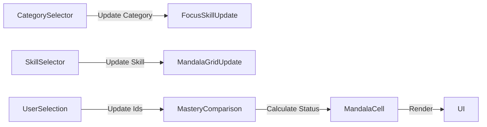

# 仕様書：スキル比較 マンダラチャート

## 1. 概要

本機能は、ユーザー自身とターゲット（候補者やパートナー）のスキル習得状況を、3x3の「マンダラチャート」形式で対比・可視化するツールです。スキルのギャップを直感的に把握することで、相互学習（Learn）や技術アドバイス（Advice）、あるいは深い共創（Sync）の可能性を提示することを目的としています。

---

## 2. 主要な役割

- **スキルギャップの可視化**: 特定のスキルドメイン（例：React, AI）における詳細因子の習得状況を自分と相手で比較します。
- **マッチング支援**: 自分が持っていないスキルを相手が持っている場合に「学べる」アイコンを表示し、パートナー選定のインサイトを提供します。
- **人材管理（タレントプール）**: 候補者をスキル習得数（マスタリー）順にソートし、特定の技術に強い人材を迅速に特定します。

---

## 3. 実装ロジックとアルゴリズム

### 3.1. マンダラセルの状態判定（Status Logic）

各セル（`MandalaCell`）は以下の数式に基づき、4つの状態を定義してスタイルを切り替えています。

- **計算式**: `status = (自分の習得状況 ? 1 : 0) + (相手の習得状況 ? 2 : 0)`
- **状態定義**:
  - `0 (EMPTY)`: 未習得（双方未習得）
  - `1 (ADVICE)`: 自分のみ習得、相手に教えられる
  - `2 (LEARN)`: 相手のみ習得、相手から学べる
  - `3 (SYNC)`: 双方が習得、共創・議論が可能

### 3.2. スキルマスタリーの算出

特定のメインスキル（マンダラの中央項目）に対する「習得数」を算出します。

- **アルゴリズム**: プロフィールデータの `mastery[skill]` 配列の長さをカウント（最大8個）。

### 3.3. リストのソート処理

タレントプールおよびパートナーリストの表示順序を動的に制御します。

- **ロジック**: `focusedSkill` に対するマスタリーカウントを比較し、`sortOrder`（desc/asc）に従ってソート。

---

## 4. データの流れ（ステート管理）

### 4.1. 主要な変数と変遷

1.  **初期データ**: `MANDALA_TEMPLATES`（定義）, `MY_PROFILES` / `CANDIDATES`（モックデータ）。
2.  **選択状態 (`useState`)**:
    - `selectedMyId` / `selectedTargetId`: 現在アクティブな自分と相手のID。
    - `selectedCategory`: `FRONTEND`, `BACKEND_AI` などのドメイン。
    - `focusedSkill`: 現在マンダラの中央に表示されているメインスキル。
3.  **派生データ (`useMemo`)**:
    - `currentMe` / `currentTarget`: IDから検索された各オブジェクト。
    - `followedCandidates` / `watchedCandidates` / `queueCandidates`: インタラクション状態に応じて分類されたリスト。

### 4.2. 遷移フロー

---

## 5. 例外処理とエッジケース

- **データ欠損ガード**: オプショナルチェイニングを使用し、未定義のスキルが選択された場合のクラッシュを防止。
- **未選択状態のハンドリング**: ターゲットが未選択の場合、詳細解析を非表示にし、プレースホルダーを表示。
- **カテゴリとスキルの整合性**: カテゴリを切り替えた際、現在のスキルが新カテゴリに含まれていない場合、自動的に先頭スキルへリセット。

---

## 6. 暗黙の仕様

- **固定スロット制**: マンダラチャートの周辺項目は常に8項目（インデックス0〜7）として管理されています。
- **習得度のバイナリ評価**: スキルの習得度は「習得(1)」「未習得(0)」の二値で管理されます。
- **非永続的なインタラクション**: セッション中の操作（Watch/Follow）はメモリ上で保持されます。
