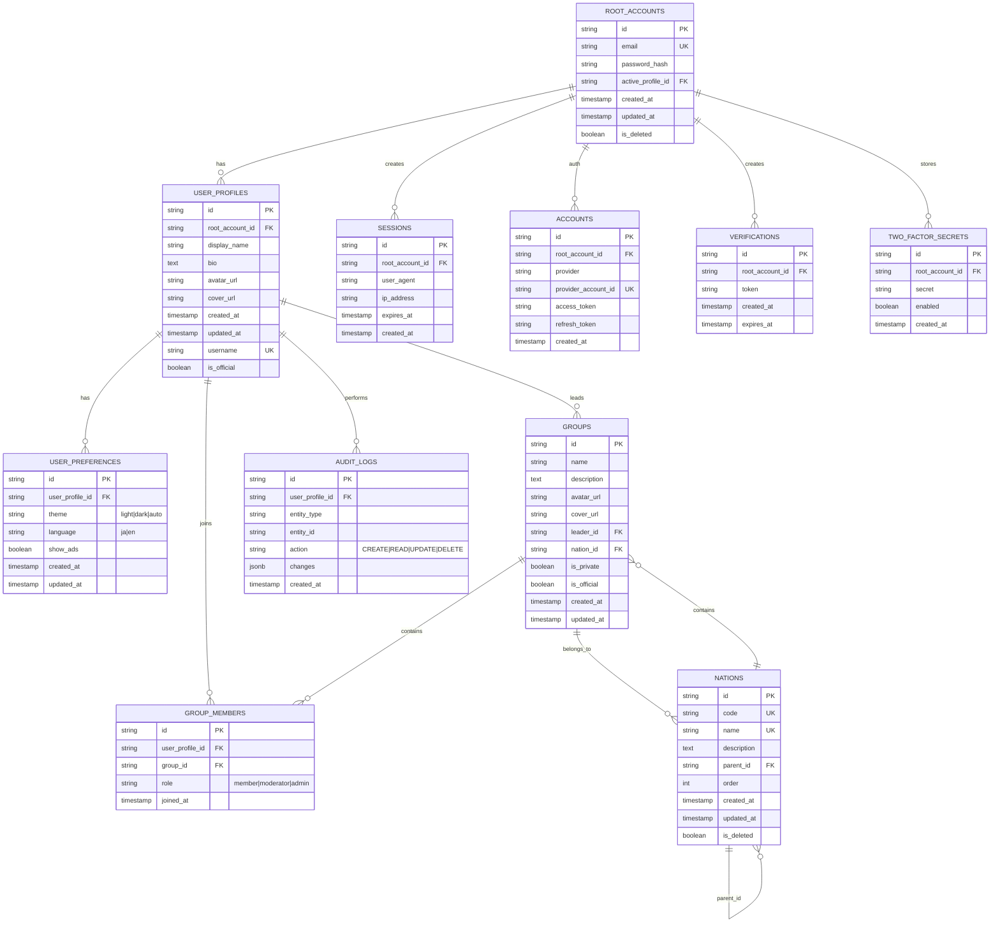

# ER図：VNS Masakinihirota スキーマ構成

> **バージョン**: 1.0
> **更新日**: 2026-03-03
> **対象**: PostgreSQL schema（public）

## 論理ER図（Mermaid）



---

## テーブル一覧

| # | テーブル | 説明 | RLS | 主キー | レコード数想定 |
|----|---------|------|-----|-------|---------------|
| 1 | `root_accounts` | 認証ユーザー（Better Auth ユーザー） | ✅ | `id` | 数千～数万 |
| 2 | `user_profiles` | ユーザープロフィール情報 | ✅ | `id` | 数千～数万 |
| 3 | `user_preferences` | ユーザー設定（テーマ、言語、広告表示） | ✅ | `id` | 数千～数万 |
| 4 | `groups` | グループ（コミュニティ） | ✅ | `id` | 数百～数千 |
| 5 | `group_members` | グループメンバーシップ | ✅ | `id` | 数千～数万 |
| 6 | `nations` | 国（グループ分類） | ✅ | `id` | 200～1000 |
| 7 | `sessions` | ログインセッション | ✅ | `id` | 数千（TTL） |
| 8 | `accounts` | OAuth アカウント | ✅ | `id` | 数千～数万 |
| 9 | `verifications` | メール認証・パスワード リセット | ✅ | `id` | 数百（TTL） |
| 10 | `two_factor_secrets` | 2FA シークレット | ✅ | `id` | 数百～千 |
| 11 | `audit_logs` | アクセス監査ログ | ✅ | `id` | 数千～数万 |

---

## リレーション（外部キー）

### 親テーブル → 子テーブル

| 親テーブル | 親キー | 子テーブル | 子キー | 操作 | 説明 |
|-----------|-------|-----------|--------|------|------|
| `root_accounts` | `id` | `user_profiles` | `root_account_id` | CASCADE DELETE | 1 ユーザー = 複数プロフィール（理論的には 1:1 だが、将来拡張性のため） |
| `root_accounts` | `id` | `sessions` | `root_account_id` | CASCADE DELETE | 1 ユーザー = 複数セッション |
| `root_accounts` | `id` | `accounts` | `root_account_id` | CASCADE DELETE | 1 ユーザー = 複数 OAuth プロバイダー |
| `root_accounts` | `id` | `verifications` | `root_account_id` | CASCADE DELETE | 1 ユーザー = 複数認証トークン |
| `root_accounts` | `id` | `two_factor_secrets` | `root_account_id` | CASCADE DELETE | 1 ユーザー = 1 2FA シークレット |
| `root_accounts` | `active_profile_id` | `user_profiles` | `id` | RESTRICT | アクティブなプロフィール |
| `user_profiles` | `id` | `user_preferences` | `user_profile_id` | CASCADE DELETE | 1 プロフィール = 1 設定 |
| `user_profiles` | `id` | `group_members` | `user_profile_id` | CASCADE DELETE | ユーザー削除時、メンバーシップも削除 |
| `user_profiles` | `id` | `audit_logs` | `user_profile_id` | CASCADE DELETE | アクセス監査ログ |
| `user_profiles` | `id` | `groups` | `leader_id` | SET NULL | グループリーダー |
| `groups` | `id` | `group_members` | `group_id` | CASCADE DELETE | グループ削除時、メンバーシップも削除 |
| `groups` | `nation_id` | `nations` | `id` | RESTRICT | グループが属する国 |
| `nations` | `id` | `nations` | `parent_id` | SET NULL | 国の親階層（階層構造） |
| `nations` | `id` | `groups` | `nation_id` | RESTRICT | 複数グループが 1 つの国に属する |

---

## ユニーク制約

| テーブル | カラム | 説明 | マルチカラム |
|---------|-------|------|-----------|
| `root_accounts` | `email` | メールアドレスの一意性 | NO |
| `user_profiles` | `username` | ユーザー名の一意性 | NO |
| `user_profiles` | `root_account_id` | 1 root account = 1 active profile | NO |
| `nations` | `code` | 国コードの一意性 | NO |
| `nations` | `name` | 国名の一意性 | NO |
| `accounts` | `(provider, provider_account_id)` | OAuth プロバイダー + ID の一意性 | YES |

---

## インデックス

### Drizzle schema.postgres.ts で定義済み

| テーブル | インデックス | 対象カラム | 用途 |
|---------|------------|---------|------|
| `root_accounts` | PRIMARY KEY | `id` | 主キー |
| `root_accounts` | UNIQUE | `email` | ログイン検索 |
| `user_profiles` | PRIMARY KEY | `id` | 主キー |
| `user_profiles` | UNIQUE | `username` | ユーザー名検索 |
| `user_profiles` | INDEX | `root_account_id` | ユーザー取得 |
| `groups` | PRIMARY KEY | `id` | 主キー |
| `groups` | INDEX | `leader_id` | グループリーダー検索 |
| `groups` | INDEX | `nation_id` | 国別グループ検索 |
| `group_members` | PRIMARY KEY | `id` | 主キー |
| `group_members` | UNIQUE | `(user_profile_id, group_id)` | メンバーシップ重複チェック |
| `group_members` | INDEX | `group_id` | グループメンバー検索 |
| `nations` | PRIMARY KEY | `id` | 主キー |
| `nations` | UNIQUE | `code` | コード検索 |
| `nations` | UNIQUE | `name` | 名称検索 |
| `nations` | INDEX | `parent_id` | 親階層検索 |

---

## Row Level Security (RLS) ポリシー

全テーブルに RLS が有効化され、以下の基本ポリシーが適用されています。詳細は `docs/database/rls-policy-specification.md` を参照。

### 基本パターン

| テーブル | SELECT | INSERT | UPDATE | DELETE |
|---------|--------|--------|--------|--------|
| `root_accounts` | 本人のみ | 禁止 | 本人のみ | 禁止 |
| `user_profiles` | 全員 | 認証済 | 本人のみ | 本人のみ |
| `user_preferences` | 本人のみ | 本人のみ | 本人のみ | 本人のみ |
| `groups` | 全員（シークレット除外） | 認証済 | リーダー・管理者 | リーダー・管理者 |
| `group_members` | 全員 | グループ管理者 | グループ管理者 | グループ管理者 |
| `nations` | 全員 | 管理者のみ | 管理者のみ | 管理者のみ |
| `audit_logs` | 本人 + 管理者 | 自動（アプリケーション） | 禁止 | 管理者のみ（保持期間後） |

---

## タイムスタンプ型

全タイムスタンプカラムは `timestamp with time zone` (`timestamptz`)：

```sql
- created_at timestamptz DEFAULT CURRENT_TIMESTAMP
- updated_at timestamptz DEFAULT CURRENT_TIMESTAMP
- expires_at timestamptz (TTL 目的)
```

> **理由**: ユーザーが複数のタイムゾーンからアクセスする場合、UTC を基準とすることで矛盾を避ける

---

## スのペース分割（パーティショニング）

現在、パーティショニングは未実装。以下の条件で将来検討：

- `audit_logs`: レコード数が 1000万を超えた場合、`created_at` で月次パーティション
- `sessions`: TTL の自動削除でカバー（パーティション不要想定）
- `group_members`: 千万規模に達した場合

---

## データ統計（目安）

初期状態（2026年3月）:

```
root_accounts:          0 (本番デプロイ前)
user_profiles:          0
user_preferences:       0
groups:                 0
group_members:          0
nations:                200～300 (マスターデータ)
sessions:               0～10 (TTL 管理)
accounts:               0
verifications:          0～100 (TTL 管理)
two_factor_secrets:     0
audit_logs:             0
```

想定成長（1年後）:

```
root_accounts:          10,000～100,000
user_profiles:          10,000～100,000
user_preferences:       10,000～100,000
groups:                 1,000～10,000
group_members:          50,000～500,000
nations:                300 (ほぼ固定)
```

---

## バージョン履歴

| バージョン | 日付 | 変更内容 |
|-----------|------|---------|
| 0.1 | 2026-03-03 | 初版（スキーマ設計確定後） |

---

## 関連ドキュメント

- [Data Dictionary](./data-dictionary.md) - テーブル・カラム詳細説明
- [RLS Policy Specification](./rls-policy-specification.md) - セキュリティポリシー詳細
- [Database Schema Design](./database-security-foundation.md) - スキーマ設計の背景

